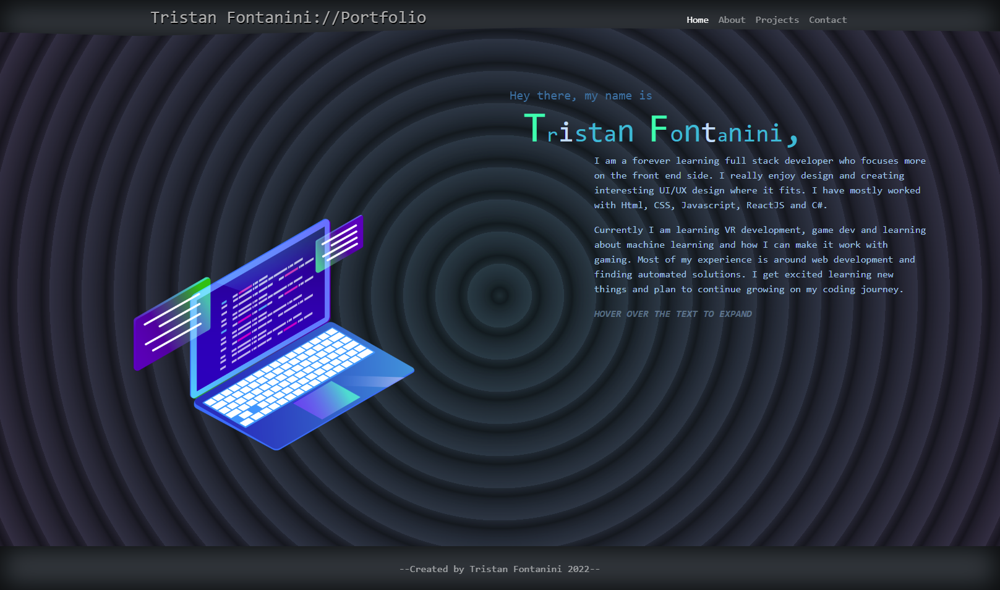
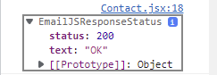

# React-Portfolio

---

## Description:

My personal portfolio built with ReactJS.
 [repo link]
 

---

## Table of Contents:

- [Usage](#usage)
- [Showcase](#showcase)
- [Technologies](#technologies)
- [Questions](#questions)

---

## Usage:

The purpose of this portfolio is to show case my work and the ability to work with different technologies.
 Deployed websit: [deploy link]
 
 NOTE: Still needs work for responsiveness. (Currently not mobile responsive, tablet responsive but about page needs more work.)

---

## Showcase:

 As you can see below the mail does send. 

 And below is the responsiveness W.I.P. 

---

## Technologies:

- Express
- React
- Node.js
- Javascript
- HTML
- CSS
- emailjs

---

## Questions:

If you have any questions or would like to reach out to me:\
<a href="https://github.com/Twistedmouse">GitHub</a>, <a href="https://www.linkedin.com/in/tristan-fontanini-b91879203/">Linkedin</a> or send over an <a href="mailto:mousy93@hotmail.com">email</a>.

---

---
